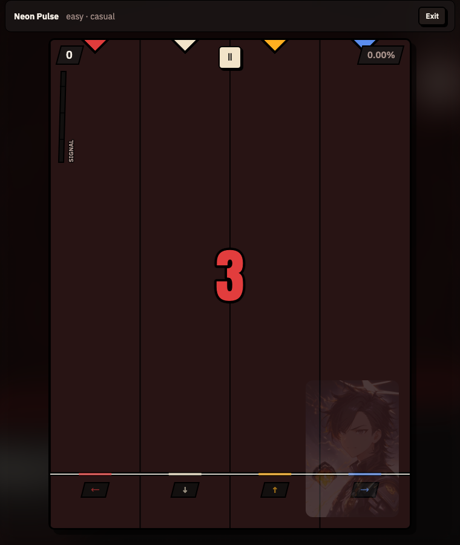
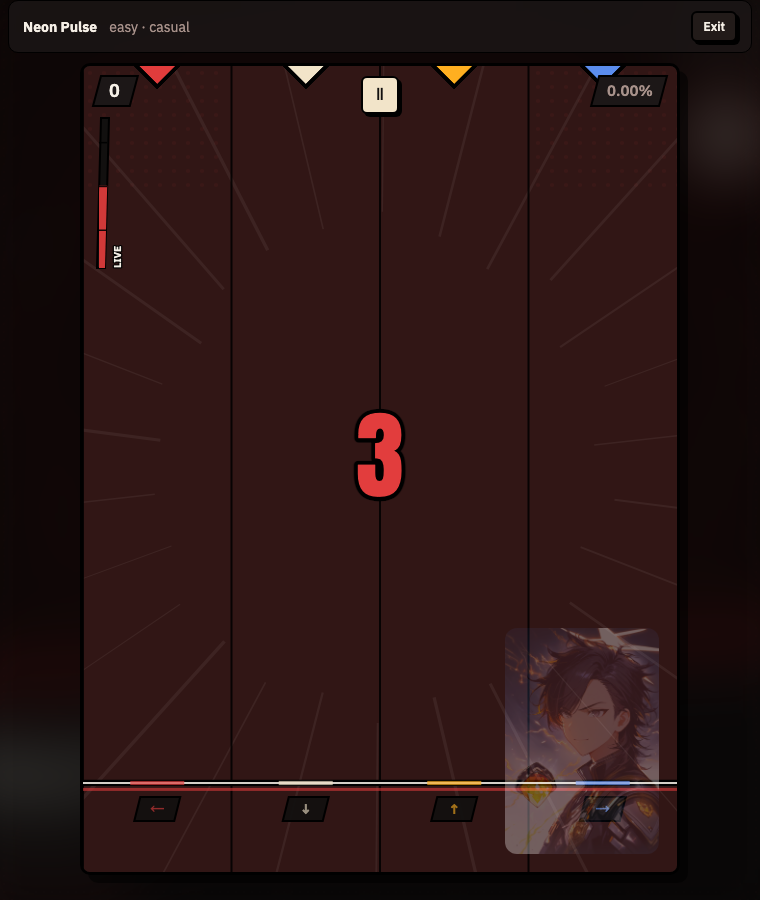
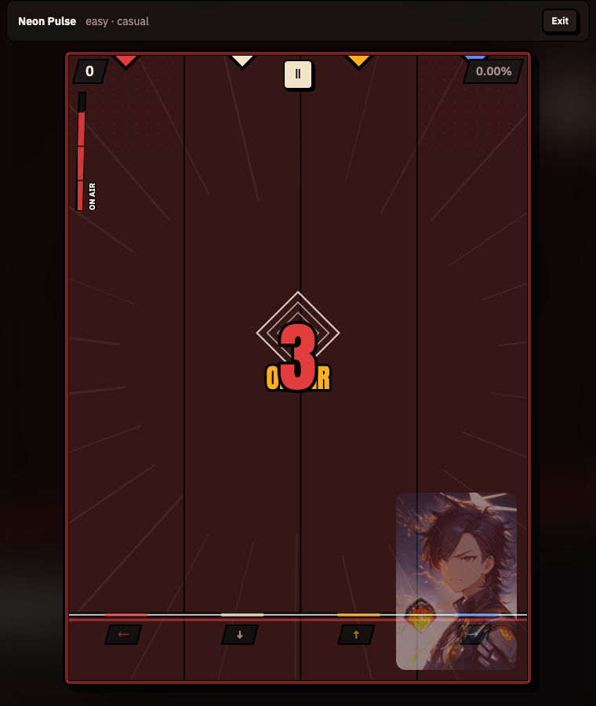
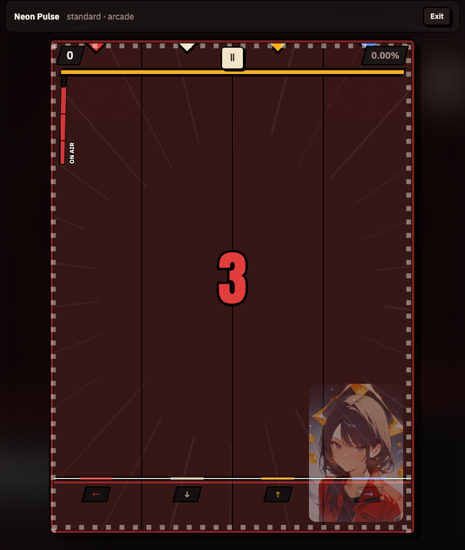
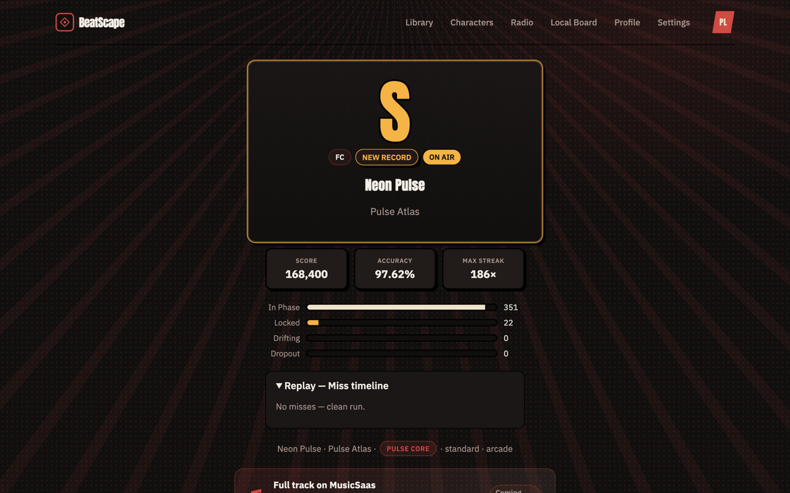
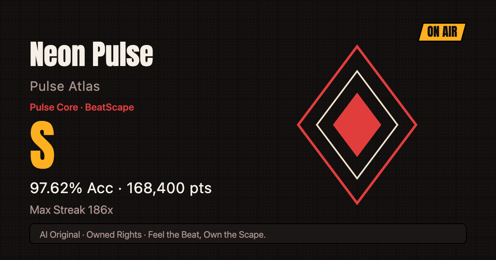

# BeatScape SIGNAL 氛围层 — 高命中玩家的界面特效优化（研究）

> **状态**: 原型已实现并验证 · 2026-08-30 · worktree `../MusicSaas-wt-surge`（branch `research/beatscape-surge-fx`）
> **TL;DR**: 现有特效全是"单点反馈"（判定粒子 / 震屏 / 连击里程碑），缺一层**随命中质量实时涨落的全场氛围**。本方案新增 **SIGNAL 信号强度表**：高命中把整个 PlayField 从"录音室"逐级推向"ON AIR 直播中"——街区被点亮、集中线 / 半调网点浮现、角色水印苏醒、共振菱形随里程碑扩散。**计分与判定窗（15/30/50）零改动**，纯表现层。

---

## 1. 问题：单点反馈没有"状态感"

现状盘点（`PlayField.tsx` v2.0 RESONANCE）：

| 已有 | 性质 |
|------|------|
| 判定粒子 + 震屏（perfect 22 粒 / 6px） | 单点，200ms 即逝 |
| 判定星爆 + EARLY/LATE 标签 | 单点 |
| 连击数字 4 档变大变色（10/50/100） | 半持续，但只作用于数字本身 |
| 里程碑全屏字 + 震屏（10/25/50/…） | 单点 |
| combo-break 红色 vignette | 单点（只惩罚不奖励） |
| 节拍 wash / District 水印 | 恒定，与表现无关 |

对**高命中玩家**的缺口：打得好时，画面与打得很差时**几乎是同一个场景**。PRD §7.2 要求的"连击梯度动态光效"目前只有连击数字在承担；角色 IP（NIGHTSHIFT 电台三人组）在对局内只是静态水印，与"电台直播"的世界观没有任何玩法联动。

## 2. 方案：SIGNAL 信号强度表（电台世界观原生）

命名按 World Bible §9.1 的「氛围层」口径（与判定术语分开，判定已改用 Perfect / Great / Good / Miss + Combo）：表叫 **SIGNAL**，三档 **TUNING → LIVE → ON AIR**——玩得热，电台就真的在"直播"，街区和驻场乐手跟着被点亮。英文单词、无拟声词，符合 PRD §7.4。

### 2.1 机制（纯逻辑，`src/engine/surge.ts`）

| 项 | 值 | 说明 |
|----|----|------|
| 热量 heat | 0–100 | 每次判定驱动 |
| perfect | +2.2 | 连续 39 个 perfect 即满档（约一句乐句） |
| great | +1.2 | casual 宽窗下 great 也养得起来 |
| good | −8 | 断档惩罚，掉档是立刻可感的 |
| miss | −16 | 一次 miss 掉近两档 |
| 自然衰减 | −2.2/s | 用歌曲时钟（暂停不衰减），杜绝"挂机 ON AIR" |
| 档位阈值 | 25 / 55 / 85 | TUNING / LIVE / ON AIR |
| maxTier | 闩锁 | 供结算页 / 海报后续读取（未接） |

**明确不做**：不碰 `judgmentScore` / `comboMultiplier` / 判定窗 / HP——PRD 工程真值不动，争议点（是否给分加成）留给 §6 决策。

### 2.2 视觉分层（全部对齐 §7.6 五条语法：平涂硬边 / 粗描边 / 漫画符码 / 共振菱形）

| 层 | TUNING (≥25) | LIVE (≥55) | ON AIR (≥85) |
|----|--------------|------------|--------------|
| District beat wash | 深度 +0.025/档 | ✓ | ✓ |
| 判定线下色带 | District 硬边色带"锁相" | ✓ | ✓ |
| 集中线（放射线） | — | 预渲染 sprite，随节拍脉动 | ✓ 更亮 |
| 半调网点（角部） | — | 节拍脉动 | ✓ |
| 音符拖尾 | — | 硬边平行四边形 streak（非渐变） | ✓ |
| ON AIR 错位边框 | — | — | 黑框 + District 色带版画错位 |
| 共振菱形环 | — | 里程碑时扩散 | ✓ 档位进入时也触发 |
| 里程碑文案 | — | — | 进档全屏 **ON AIR** 闪现 |
| 角色水印（DOM/CSS） | 0.22 + 轻微饱和 | 0.32 | 0.46 + 提饱和对比，"上灯" |
| SIGNAL 表（HUD） | 始终显示：斜切面板 + 阈值刻度 + 竖排档位文案；**掉档时整表红闪 450ms**（纯视觉，miss/break 音效已覆盖声音层） | | |

### 2.2b LIGHTING 灯光组（连续命中驱动 · 用户命题"引入专业灯光师"）

档位表达"状态"，灯光组表达"当下有多热"——dimmer board 就是连击本身，全部平涂硬边、无渐变辉光、无高频频闪（单发 fixtures ≤ 每小节一次，安全线内），整层包 `fancyFxOn()` 降级门：

| 灯具 | 触发 | 效果 |
|------|------|------|
| 跑马灯 | tier≥1 且 combo≥25 | 顶边（ON AIR 后四边）扁平圆点追逐，**速度随连击提升**（45→195 px/s）；色纸（gel）按小节轮换四道色，每第 5 颗米白 |
| 光柱 | 每跨过 25 连击 | 命中道全高光柱 + 米白芯线，380ms 衰减 |
| 扫光束 | 每跨过 100 连击 | 角部斜切光束横扫全场 900ms，District 色 + 米白硬芯线，左右交替 |
| 灯光秀（idle show） | combo≥100 常驻 | 灯组不等你——每小节轮道补一枚光柱；combo≥150 后隔小节补扫光束，防"常驻变壁纸" |
| 换色纸 | 上述全部灯具 | 颜色按小节在四道色间轮换（街区主色保留给 wash，灯具负责花） |

驱动值 = `max(session.combo, demoCombo)`；连击归零灯组复位，爬回来会重新逐档点亮（再入弧线）。

### 2.2c FEEL PACK 爽感包（用户命题"一次性干完"· 全通道覆盖）

视觉三层之外，把爽感补进耳朵/手指/循环/结算（全部不碰计分与判定窗）：

| 项 | 内容 | 落点 |
|----|------|------|
| 分层打击音 | 命中音随 SIGNAL 档位增厚：TUNING+ 加 clap 层、LIVE+ 加 hi-hat 泛音、ON AIR 加低频垫（padLow）——打得越热，每次敲击越"满" | `hitsounds.ts playHit()` |
| The drop | 进 ON AIR 瞬间音乐 duck 进低通（280Hz，60ms）再 380ms 开闸——字面意义的 the drop，歌才"开门"；`begin()` 时复位为全通 | `playback.ts sweepOpen()` |
| FFT 呼吸 | `AnalyserNode` 读真实音乐低频（前 10 bin），与 BPM 脉动混合驱动 wash/判定线——场子跟实际声音呼吸，暂停/倒计时回落 0 | `playback.ts getBassEnergy()` |
| 触觉 | perfect/great/good 轻震 8ms（80ms 节流）、miss 35ms、进档双脉冲 [12,60,24]、里程碑 [18]；Android/Chromium 生效，iOS 自动跳过；`hitsound` 设置为总闸 | `lib/haptics.ts` |
| R 键即时重开 | 对局内按 R（未绑道时）→ 新 session + 引用全复位 + 直接进倒计时；R 被绑为道键时不触发 | `PlayField restartRun()` |
| 结算 dopamine | Grade 盖章动画（550ms 回弹）+ 盖章音（wood crack+thump+闷铃）、分数 900ms 滚动计数、徽标依次 pop、FC/AP 局 hero 卡米白闪光；reduced-motion 全静态 | `Results.tsx` + styles |

**z 序/安全**：filter 常驻全通（20kHz）直到 drop 触发，music 链路无常态损耗；震动有节流；动画全部 reduced-motion 降级。


### 2.3 实测截图（`docs/assets/`，dev 钩子 `?surge=N` 锁档 + 无头 Chrome 虚拟时间采集）

| 基准（heat 0） | LIVE（heat 55） | ON AIR（heat 85+） |
|----------------|-----------------|--------------------|
|  |  |  |

三档差异一眼可辨：表从空→半→满；ON AIR 档边框 + 菱形环 + 全亮水印。水印点亮在真机截图（IAB 全页截图）中已验证。

LIGHTING 灯光组（`?surge=3&combo=150` 锁定连击采集，四边跑马灯 + 灯光秀光柱同框）：



结算闭环（预置 ON AIR 局实机验证）：

| Results 徽标 | 分享海报 |
|--------------|----------|
|  |  |

## 3. 实现落点（最小 diff）

| 文件 | 改动 |
|------|------|
| `src/engine/surge.ts` **(新)** | 纯逻辑：`SurgeMeter` / `tierForHeat` / 常量；与 `judge.ts` 同构，可单测 |
| `src/engine/surge.test.ts` **(新)** | 9 用例：阈值边界 / miss 掉档 / maxTier 闩锁 / 衰减夹取 / reset |
| `src/components/PlayField.tsx` | 判定入口（press/release/tick-miss）喂 heat；rAF 循环衰减 + 档位翻转（`data-surge` 写在 wrapper 上，零 React 重渲染）；draw 新增 5 个绘制块；3 个预渲染工具函数；结算时把闩锁的 `surgeMaxTier` 附进 `PlayResult` |
| `src/constants/scape.ts` | `SURGE_COPY` 文案 token（与 JUDGE_COPY/COMBO_COPY 并列） |
| `src/styles.css` | 水印按 `data-surge` 三档过渡（opacity/filter transition）；`.badge.signal(.onair)` 结算徽标样式 |
| `src/types/chart.ts` | `PlayResult` / `LastRun` 增可选 `surgeMaxTier?: 0\|1\|2\|3`（加性字段，不动既有契约） |
| `src/storage/session.ts` | `writeLastRun` 透传 `surgeMaxTier` |
| `src/pages/Results.tsx` | hero 卡徽标行：LIVE 峰值 → `PEAK SIGNAL · LIVE`（琥珀描边），ON AIR → `ON AIR`（实心金） |
| `src/lib/sharePoster.ts` | 海报右上角斜切金色 `ON AIR` 章——仅最高档 earns poster space |
| `src/audio/hitsounds.ts` | `bell()`/`strike()` 加可选 `at` 偏移（可排程序化短句）；新增 `playSurgeTier(2\|3)` 进档音效（LIVE 双音上扬 / ON AIR 三音 chime + 载波噪声涌起，全合成零采样）；`playHit` 加可选档位参——ON AIR 的 perfect 叠一层极轻高频泛音（peak 0.06，不遮音乐） |

**性能预算**（PRD §7.3 不掉帧 + §19 低端降级）：
- 集中线 / 半调网点 / 菱形环全部**预渲染**，每帧只 `drawImage` + alpha（延续 noteSprite 的 shadowBlur 教训）
- 零 gradient、零 shadowBlur、零 DOM 频繁写（档位翻转才碰一次 `dataset`）
- 档位视觉全部包在 `fancyFxOn()` 里（设置关闭 / `prefers-reduced-motion` 自动降级为仅 SIGNAL 表 + wash）
- 构建 gzip 99.6 → 101.9 kB（+2.3 kB）
- ⚠️ 帧率为**设计级论证**（每层单次 blit、无逐帧昂贵 ctx 操作），本研究环境无法做可信实测（macOS 被遮挡窗口 rAF 冻结 / 无头 Chrome 软件渲染失真）——**真机 60Hz + 低端安卓帧率待人工验证**

**dev 钩子**（仅 `import.meta.env.DEV`，生产剔除）：`?surge=N` 锁档 + `?autostart` 跳过开局，用于无头采集三档静帧。

## 4. 验证

- `pnpm test`：**105/105**（96 基线 + 9 surge）
- `npm run build`（tsc --noEmit + vite）：干净
- 三档视觉实测截图见 §2.3；rAF 实机跑通（IAB 全页截图 + canvas 逐帧确认）

## 5. 为什么不是其他方案

- **直接给分数加成（FEVER 倍率）**：动计分真值，牵连排行榜公平性与 PRD §4.4 maxScore 校验；且新玩家先要"看得见自己打得好"，再谈"值更多分"。氛围层是零风险第一步。
- **纯连击驱动（不看判定质量）**：great 刷连也能 ON AIR，与"高命中"诉求不符；且 combo 归零的瞬间氛围全灭太惩罚，热量衰减曲线更平滑。
- **DOM/CSS 粒子层**：违背现有 canvas 单循环架构，移动端掉帧风险高。

## 6. 后续决策点（未实现，需拍板）

1. **要不要给分**：ON AIR 期间 ×1.05 之类的小加成 vs 纯荣誉。动计分则需同步 PRD §4 与排行榜口径。**v1 默认（未拍板时的保守解）：纯荣誉，零计分影响**——后续若要加成，另开研究轮。
2. **结算联动**：✅ 原型已实现——`maxTier` 闩锁随 `PlayResult.surgeMaxTier` 进 `LastRun`，Results 徽标（LIVE→琥珀描边 / ON AIR→实心金）+ 海报右上斜切金章（仅 tier 3）；文案与是否保留海报章待定稿。
3. **音频联动**：✅ 原型已实现——`playSurgeTier()` 进档音效（受 `hitsound` 设置门控）+ ON AIR 档 perfect 泛音；音色/音量是否合适需人工听感。
4. **BPM 硬对齐**：当前脉动用 `beatPulse`（BPM 换算），已对齐；若后续切曲目中段变速需改接 conductor 拍相位。
5. **数值调参**：+2.2/−8/−16/2.2s 是首版手感值，建议盲测时收集"什么时候感觉到 ON AIR"。
6. **World Bible 审校**：TUNING/LIVE/ON AIR 文案入 Bible §9 文案包。
7. **移动端实测**：水印 transition 在低端 Android 的合成开销（filter: saturate 可能吃 GPU）。

## 7. 复现与回滚

> **收尾状态（2026-08-30）**：结构化确认未获答复，按保守默认收——**原型留在 worktree 待人工验证（听感 / 真机帧率），不自动合入主工作区**；计分 v1 默认纯荣誉（§6-1）。说"合入"即搬 diff（10 个代码文件：§3 表所列）；说"丢弃"即删 worktree + `git branch -D research/beatscape-surge-fx`。
>
> **一键合入已备好**：`docs/BEATSCAPE-SURGE-FX.patch`（883 行，10 个代码文件）已对主工作区当前状态 `git apply --check` 干跑通过。合入 = 主仓根目录执行：
> ```bash
> git apply ../MusicSaas-wt-surge/docs/BEATSCAPE-SURGE-FX.patch
> # 再拷研究文档与截图：
> cp -r ../MusicSaas-wt-surge/docs/BEATSCAPE-SURGE-FX.md ../MusicSaas-wt-surge/docs/assets docs/
> ```
> 注意：patch 冻结的是 2026-08-30 的主工作区状态；若此后 PlayField 等文件有改动，需重出 patch（worktree src 与主区 rsync 后重跑 diff）。

```bash
cd ../MusicSaas-wt-surge   # worktree，主工作区零污染
pnpm --filter @musicsaas/beatscape test
pnpm dev:beatscape         # http://localhost:5175/beatscape/play/bs-s1-01?tier=easy&mode=casual&surge=3
```

主工作区完全未动；合入 = 把 worktree 内 §3 表所列 9 个文件的 diff 手动搬运。放弃 = 删除 worktree + `git branch -D research/beatscape-surge-fx`。

---

## 8. 附录：World Bible §9 文案包（草案 · 待定稿）

> 拍板后可整块搬入 `BEATSCAPE-WORLDBIBLE.md` §9 文案包。术语口径属氛围层（电台状态），与判定术语（Perfect / Great / Good / Miss、Combo）分开，见 World Bible §9.1；英文单词、无拟声词、无表情贴纸（PRD §7.4 / §7.6 合规）。

| 场景 | EN 文案 | 备注 |
|------|---------|------|
| 仪表名 | `SIGNAL` | 与 ATLAS 的场强仪（field-strength meter）motif 呼应 |
| 档 1（heat ≥25） | `TUNING` | 调谐中——起步反馈，弱存在感 |
| 档 2（heat ≥55） | `LIVE` | 电台在播；结算徽标 `PEAK SIGNAL · LIVE` |
| 档 3（heat ≥85） | `ON AIR` | 直播中；进档全屏闪现 + 海报金章；呼应 JUNO 的 ON AIR badge |
| 升档音效旁白（可选，Settings 文案） | `The station is live.` | 仅 Settings/帮助页使用，对局内无旁白 |
| 掉档（无文案，仅红闪） | — | 不加判定词复用——Miss 已属判定层，氛围层不占用，语义不混用 |

**红线自查**：无日文拟声 ✓ · 无第三方作品名 ✓ · 素材全自有 ✓ · 不与判定文案（Perfect/Great/Good/Miss）语义冲突 ✓（TUNING/LIVE/ON AIR 描述的是"电台状态"而非"判定质量"）。
